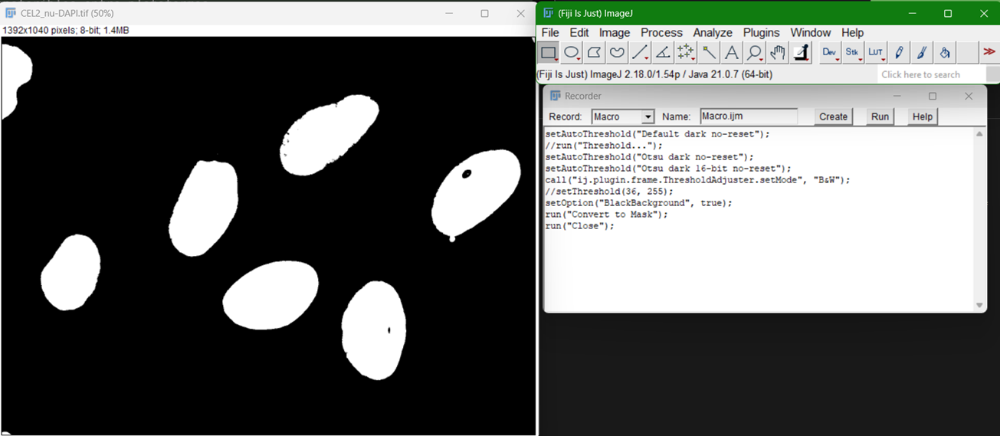

# Práctica: Cuantificación de PML por Núcleo

**Objetivo:** Aprender a construir un macro de Fiji. 

**Objetivo adicional**: Aprender a realizar un análisis de co-localización y cuantificación celular mediante la segmentación automatizada de núcleos, la detección de objetos puntuales (PML) y el análisis espacial cruzado utilizando el Gestor de Regiones de Interés (ROI Manager) en FIJI/ImageJ.

**Materiales necesarios:** Imágenes de microscopía de fluorescencia:
* **Canal 1:** Marcación de núcleos celulares.
* **Canal 2:** Marcación de cuerpos promielocíticos de leucemia en el núcleo celular (PML).
* **Canal 3:** Marcación de actina.

---

## Antes de empezar: cómo funciona el Macro Recorder

Durante **toda esta guía** vamos a trabajar con el **Macro Recorder** de FIJI para que cada paso quede guardado y, al final, podamos automatizar el análisis.

1. Abre el grabador en `Plugins > Macros > Record...`.
2. Elige el lenguaje **ImageJ Macro** (opción recomendada para empezar).
3. Deja la ventana del Recorder visible mientras haces cada acción en FIJI (threshold, analyze particles, find maxima, measure, etc.).
4. Verás que el Recorder escribe automáticamente líneas de código como `run("...")` con los parámetros que usaste.
5. Puedes copiar esas líneas a un archivo `.ijm`, editarlas manualmente y reutilizarlas para procesar muchas imágenes.

> **Importante:** el Recorder no “adivina” tu intención; solo registra clics/comandos. Por eso, durante la práctica iremos ajustando los parámetros de forma cuidadosa para que luego el macro sea robusto.

### Abrir las Imágenes

1. **Abre la imagen:** Arrastra los archivos a FIJI o ve a `File > Open...` y abre ambos canales.
2. **Ajuste de Brillo y Contraste:** * Selecciona el canal de los núcleos y ve a `Image > Adjust > Brightness/Contrast...` (o usa `Ctrl + Shift + C` / `Cmd + Shift + C`).
   * Ajusta los niveles para visualizar claramente los límites de cada núcleo sin saturar la imagen. Haz lo mismo para el canal de los PML. 
   * *Nota:* Este ajuste es puramente visual y no altera los valores de los píxeles (siempre y cuando **no** hagas clic en el botón *Apply*).

---

### Segmentación de Núcleos

En esta sección trabajaremos exclusivamente con la imagen correspondiente al **canal de los núcleos**.

1. **Aplicar Threshold (Umbralización):** Ve a `Image > Adjust > Threshold...`.
   * Explora los diferentes algoritmos disponibles en el menú desplegable (Otsu, Yen, IsoData, Li, etc.). 
   * Selecciona el método que mejor separe los núcleos del fondo difuso y haz clic en **Apply**. Ahora tendrás una imagen binaria (blanco y negro).

> **💡 Pro-Tip sobre Operaciones Morfológicas y Desplazamiento de Canales:**
> En microscopía multicanal, a veces ocurre un ligero desalineamiento físico o aberración cromática entre los filtros, lo que provoca un pequeño corrimiento (shift) espacial entre el canal del núcleo y el de los PML. Si tus máscaras nucleares quedan muy ajustadas, corres el riesgo de dejar fuera los PML que están justo en la periferia o borde nuclear. 
> Para solucionar esto, realiza una **dilatación morfológica** yendo a `Process > Binary > Dilate`. Esto expandirá el borde de las máscaras de los núcleos en 1 píxel, asegurando que cubran el área de influencia del corrimiento cromático.

2. **Generar Regiones de Interés (ROIs):** Ve a `Analyze > Analyze Particles...`.
   * Configura el tamaño (*Size*) para excluir elementos muy pequeños (ruido) o muy grandes (artefactos).
   * En el menú *Show*, selecciona **Nothing** u **Overlay**.
   * Asegúrate de marcar la casilla **Add to Manager**. Haz clic en *OK*.
   * Verás cómo se abre el *ROI Manager* conteniendo la lista de todos los núcleos detectados.

---

### Detección Puntual de PML (Find Maxima)

Ahora cambia a la imagen original correspondiente al **canal de los PML**.

1. **Detección de puntos:** Ve a `Process > Find Maxima...`.
2. **Ajuste de Prominencia:** Modifica el valor de *Prominence* (o *Noise Tolerance* según la versión de FIJI) mientras activas la casilla *Preview point selection*. El objetivo es que se marque un único punto sobre cada P-body real, evitando contar el ruido del fondo.
3. **Generar imagen de puntos:** En el menú desplegable *Output type*, selecciona **Single Points** y haz clic en *OK*.
4. FIJI generará una nueva imagen binaria donde cada P-body detectado estará representado por un único píxel de máxima intensidad sobre un fondo negro.

---

### Cuantificación de PML por Núcleo

En este paso final utilizaremos las ROIs de los núcleos generadas y las aplicaremos sobre la imagen de puntos de los PML.

1. Selecciona la ventana de la imagen binaria de **Single Points** generada en la parte anterior.
2. Abre el configurador de mediciones en `Analyze > Set Measurements...`. Asegúrate de que estén tildadas las opciones **Area**, **Integrated Density** y **Mean Gray Value**.
3. En la ventana del *ROI Manager*, asegúrate de que no haya ninguna ROI seleccionada individualmente (para que se midan todas) y haz clic en el botón **Measure**. Se abrirá la tabla de *Results*.

---

### Cuestionario y Análisis de Resultados

Analiza la tabla de *Results* exportada y responde las siguientes preguntas:

1. **Validación de la segmentación:** Mira el número total de filas en tu tabla de resultados. ¿La cantidad de núcleos detectados de forma automatizada tiene sentido en comparación con una inspección visual rápida de la imagen original? ¿Hubo núcleos fusionados o ruido contado como núcleo?
2. **Interpretación de la Intensidad:** Si miramos la columna de la intensidad total (*Raw Integrated Density*) por cada núcleo, ¿este valor se condice directamente con la cantidad de PML que hay dentro de ese núcleo? Explica qué cálculo matemático tendrías que hacer de forma manual con ese número para saber el conteo real.
3. **Efecto de la normalización:** ¿Qué ocurre con el valor de la Intensidad Integrada (*Raw Integrated Density*) si aplicamos el tip de **dividir toda la imagen por 255** antes de medir? ¿Por qué hace falta o por qué simplifica drásticamente este paso la cuantificación de objetos puntuales?

> **💡 Pro-Tip Matemático: El truco de la división por 255:**
> Cuando FIJI crea una imagen binaria de puntos (*Single Points*), los píxeles del fondo valen `0` y los píxeles de los puntos detectados valen `255` (el valor máximo en imágenes de 8 bits). 
> Si vas a realizar operaciones matemáticas o evaluar la densidad integrada, es sumamente útil normalizar esta imagen. Puedes ir a `Process > Math > Divide...` e ingresar el valor `255` antes de realizar las mediciones.

---

### Automatización final: generar un macro para correr sobre todas las imágenes

Una vez completada la práctica manual (siempre con el Recorder encendido), vamos a consolidar los pasos en un **macro único** para procesar por lote los archivos del directorio `data`.

**Objetivo del macro final:**
- Recorrer todos los archivos con patrón: `CEL{N}_{stain}.tif`
- Ejemplos reales: `CEL1_nu-DAPI.tif`, `CEL1_pml-GFP.tif`, `CEL1_ACTINA-texasRed.tif`
- Repetir automáticamente segmentación, detección de PML y medición por ROI para cada célula

**Estrategia sugerida:**
1. Copiar desde el Recorder los comandos ya validados durante la guía.
2. Reemplazar rutas fijas por variables (carpeta de entrada/salida).
3. Agrupar por identificador de célula (`CEL1`, `CEL2`, `CEL3`, etc.) para usar juntos los canales correspondientes.
4. Guardar resultados (CSV) por imagen o en una tabla consolidada.

**Placeholder de imágenes (agregar luego):**
- `[Imagen aquí: código macro final en el editor de FIJI]`
- `[Imagen aquí: ejecución por lote sobre carpeta data]`
- `[Imagen aquí: archivos de resultados exportados]`

