# Guía de Segmentación con Fiji

Esta guía práctica cubre el flujo de trabajo completo para la segmentación de imágenes usando Fiji.

## Objetivos de aprendizaje

Al finalizar esta sección, serás capaz de:
- Cargar y visualizar imágenes en Fiji
- Aplicar técnicas de preprocesamiento (eliminación de fondo, suavizado)
- Realizar umbralización y binarización
- Crear etiquetas de componentes conexos
- Refinar la segmentación mediante operaciones morfológicas
- Extraer y visualizar medidas morfológicas

## Descripción del pipeline de segmentación

El flujo de trabajo completo sigue estos pasos:

```
Imagen cruda
    ↓
Preprocesamiento: Eliminar fondo y ruido
    ↓ 
Binarización: Convertir a máscara de primer plano/fondo
    ↓
Etiquetado: Asignar IDs únicos a objetos individuales
    ↓
Refinamiento: Mejorar la calidad de las etiquetas mediante operaciones separación de objetos
    ↓
Cuantificación: Extraer medidas morfológicas y de intensidad
    ↓
Visualización: Analizar y explorar resultados
```

## Ejecución de la práctica

### Iniciar Fiji y cargar la imagen

El método más fácil es usar arrastrar y soltar (drag-and-drop) en el área gris.

Otra opción es:

1. Archivo → Abrir (o Ctrl+O / Cmd+O)

2. Navega hasta tu archivo de imagen y selecciónalo

3. Haz clic en Abrir

La imagen se mostrará en una ventana nueva con el nombre de archivo en la barra de título.

En muchos casos, el complemento BioFormats (BioFormats Plugin) se ejecutará automáticamente para abrir la imagen.

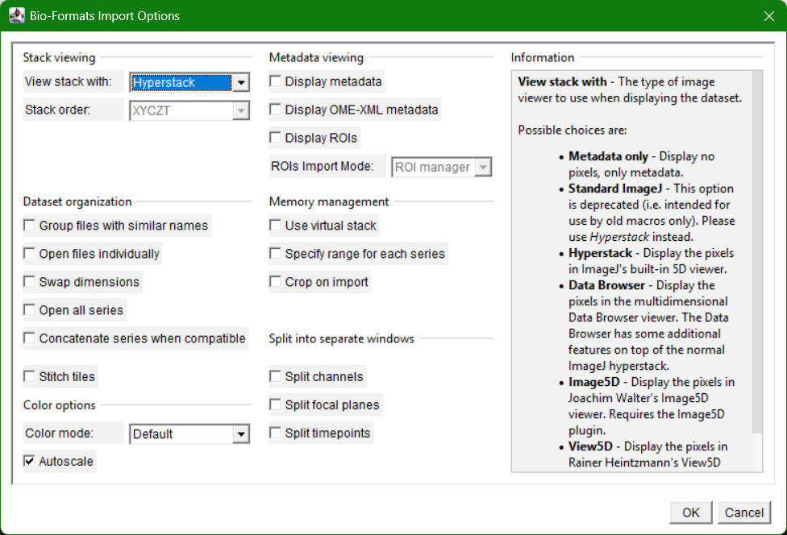

### Comprobación de las propiedades de la imagen

Después de abrir una imagen, comprueba primero su cabecera. ¿Cuáles son los valores en la parte superior?

¿Puedes comprobar sus metadatos? (ve a `Image > Show Info...`)

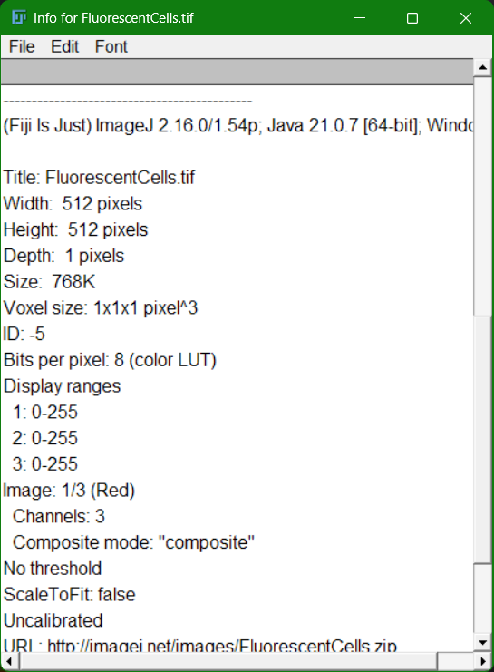

Completa la siguiente tabla:

| Elemento de metadatos | Valor |
|---|---|
| Tamaño de píxel ($\mu\text{m}$) | |
| Magnificación | |
| Apertura numérica ($\text{NA}$) | |
| bit-depth | |
| Dimensiones de la imagen (ancho $\times$ alto) | |
| Número de canales | |
| Número de cortes (si es un $z$-stack) | |
| Dimensiones del vóxel | |
| Unidad | |

### Preprocesamiento

Comencemos por realizar un preprocesamiento de la imagen. Primero separemos los canales y quedemonos con el canal de los núcleos.

Seleccioná `Image > Color > Split Channels`.

Luego mejora la visualización para entender en qué consiste la imagen. Sugiero usar HiLo como LUT y luego acotar el mínimo y máximo de intensidad para que se vean los efectos de la iluminación.

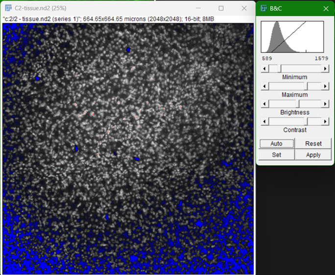

Para deshacernos de lago del ruido de adquisición vamos a aplciar un filtro de mediana utilizando `Process > Filters > Median...` y podemos utilizar un valor de 3 píxeles para el radio.

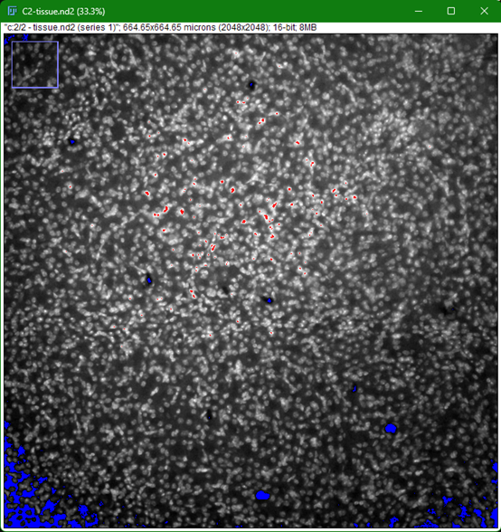

Para homogeneizar la iluminación, utilizaremos el algoritmo de rolling ball. Estima el ancho de cualquiera de los núcleos y utilizalo para aplicar `Process > Subtract Background...`.

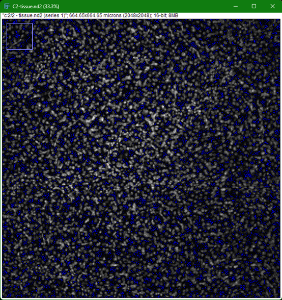

<--! En este caso un nucleo tiene aproximadamente 7 micras o 23 pixeles. Utilizar una bola de 30 a 40 pixeles suele funcionar.-->

### Segmentación

Hay varias publicaciones y algoritmos que estiman el umbral a utilizarse a partir de la estadística de intensidades de los píxeles en una imagen. Estas operaciones también pueden aplicarse en ventanas locales si varía la intensidad. Los distintos programas suelen tener un método de aplicar distintos umbrales o incluso para probar todos al mismo tiempo.

En Fiji iremos a `Image > Adjust > Auto Threshold`.

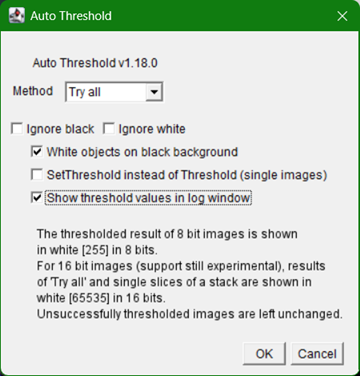

Aplicaremos todos los métodos con Try all y tildaremos la opción para ver los valores de threshold de cada método en la consola de Fiji.

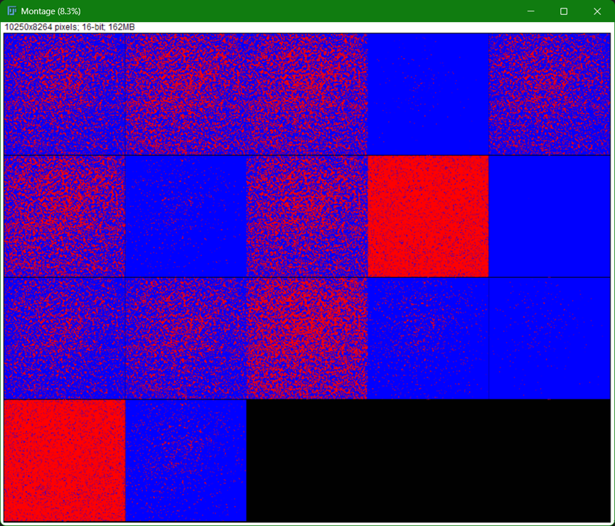

Una vez seleccionado el método de preferencia, podemos aplicar yendo a `Image > Adjust > Threshold...`. Analicen a que corresponden las distintas opciones y discutan.

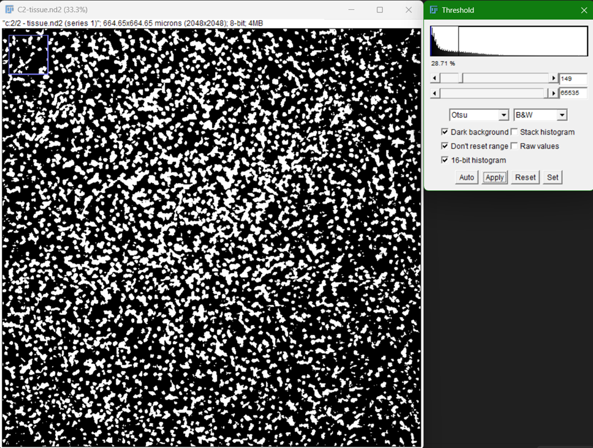

¿Qué valores de intensidad tomaron los píxeles de la imagen? ¿Por qué?

<--!n buen momento para que los alumnos comprendan que la operación de segmentación binaria toma una imagen con cierta forma y devuelve una mascara binaria de la misma forma que la original, pero solo dos valores posibles (True vs False; 0 y 1; 0 y 255 en el caso de Fiji). -->

### Operaciones Morfológicas

Como se puede apreciar, la mascara binaria tiene varias detecciones pequeñas e irregularidades. Analicen que hacen las distintas operaciones morfólogicas y si alguna mejora la máscara generada. Tip: pueden utilizar `Process > Binary > Options...` para probar concatenar varias operaciones y más de una iteración de las operaciones.

### Watershed

Una vez mejorada la imagen, necesitaremos separar los objetos que se encuentran muy cerca de otros. Hay que destacar que hay muchas formas de aplicar `Watershed`. Dentro de `Process > Binary > Watershed` encontraremos una forma clásica de aplicarlo que solo tiene en cuenta la forma. [MorphoLibJ](https://imagej.net/plugins/classic-watershed) cuenta con una variante que tiene más parámetros expuestos para modificar y ser más creativo, y hay aún más formas.

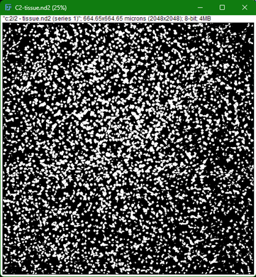

### Cuantificación

Nuestro siguiente paso será identificar los objetos por separado, es decir, una máscara por etiquetas (*labeled mask*). Para ello, primero deberemos seleccionar los atributos que querramos obtener de la cuantificación de `Analyze > Set Measurements...`.

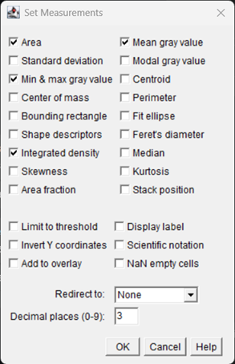

 Seleccionaremos: `Min & Max gray value`, `Mean gray value` e `Integrated density` para tener una buena descripción de las intensidades, y además, `Area`, `Shape descriptors` y `Fit ellipse` para tener descriptores de la forma. A continuación, utilizaremos `Analyze > Analyze Particles...` para generar las regiones correspondientes cada núcleo. Consideren las opciones iniciales de filtrado.

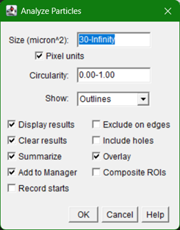

Y el resultado se verá como el siguiente.

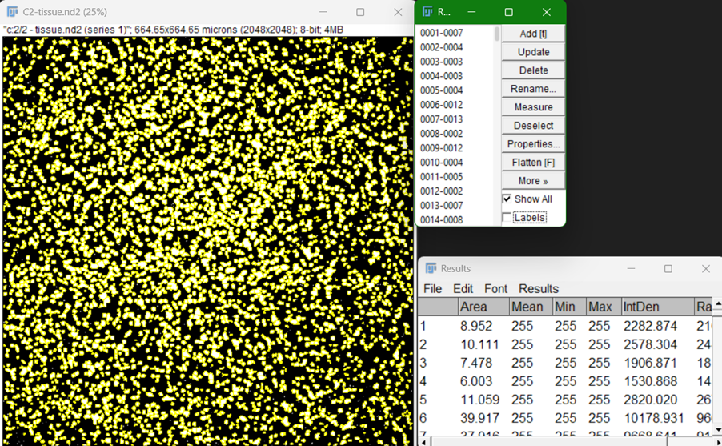

¿Qué quiere decir la primer columna de la tabla? ¿Tienen sentido los valores devueltos? Revisen el máximo de intensidad para cada objeto detectado, ¿esta bien?

<--! Es un buen momento para notar que aunque es una forma útil de obtener una lista de valores, necesitaremos indagar sobre como proveer de una imagen con la intensidad corregida para poder recuperar valores de intensidad útiles. También hay que considerar que ningún objeto puede ser más pequeño que el límite de tamaño impuesto por el filtro, lo que nos puede introducir un sezgo en nuestro análisis si no somos cuidadosos.-->