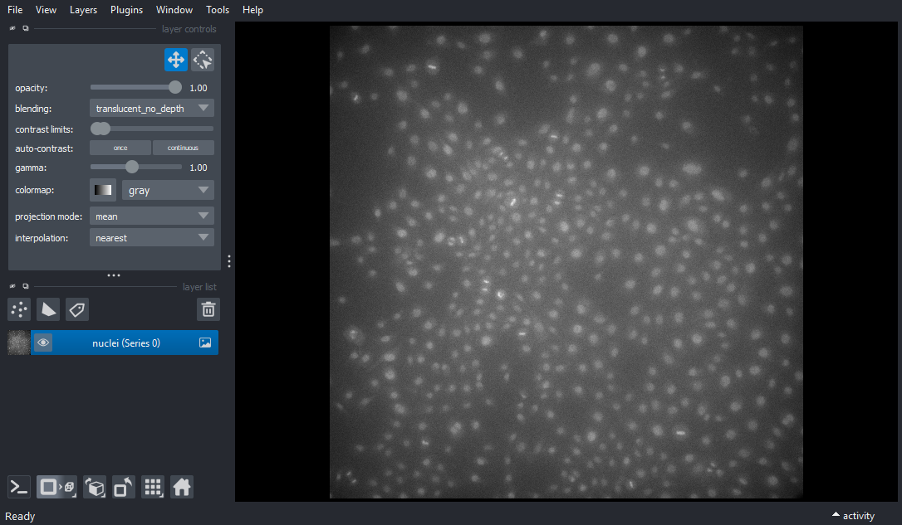
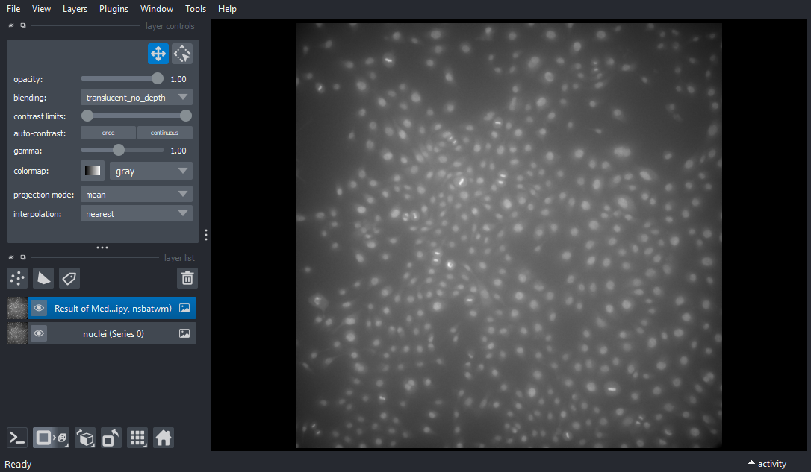
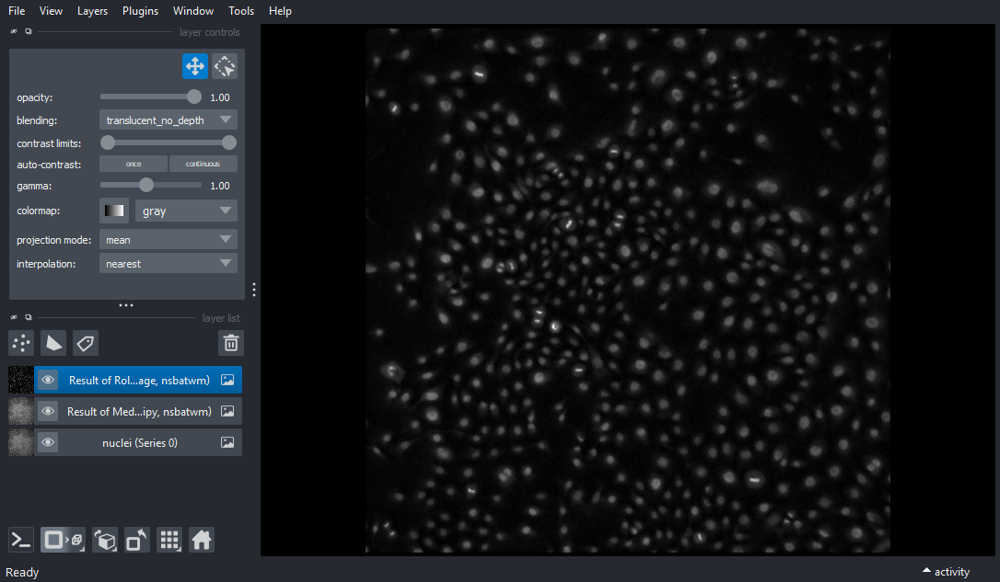
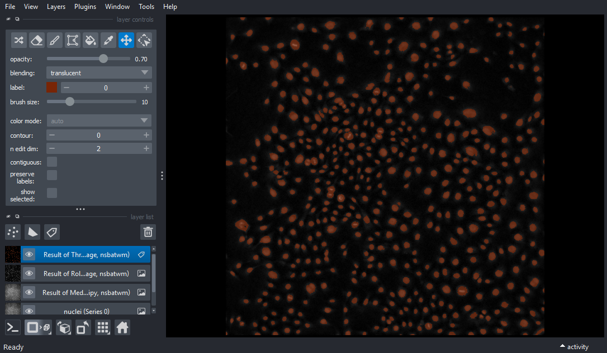
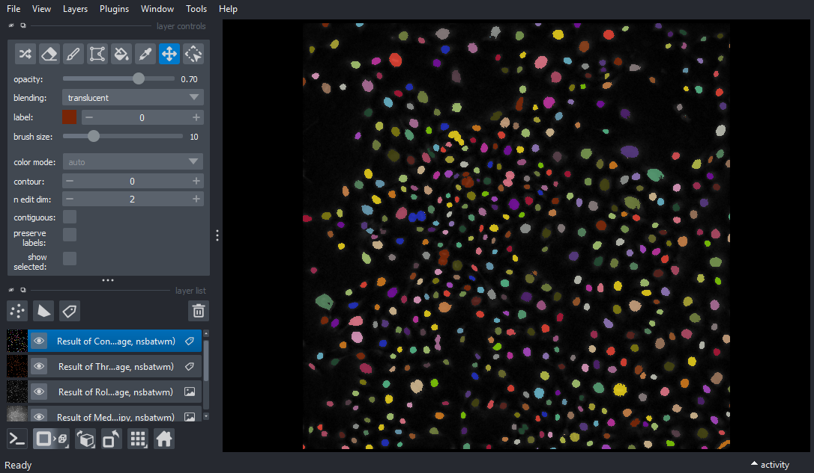
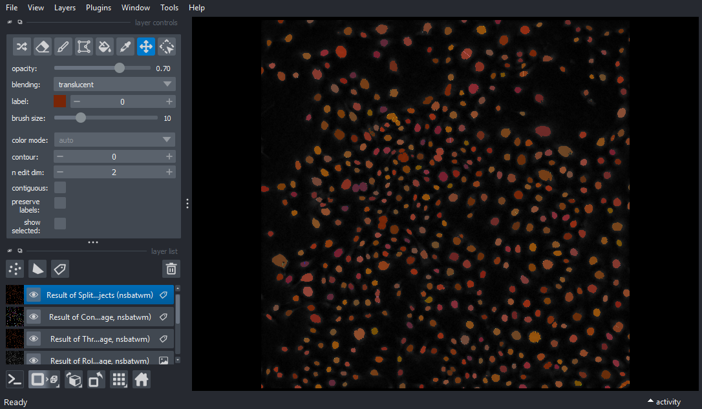
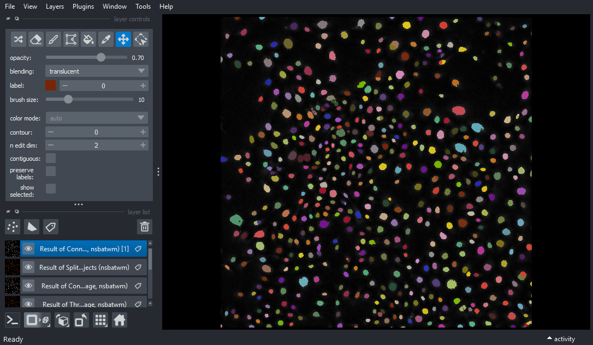
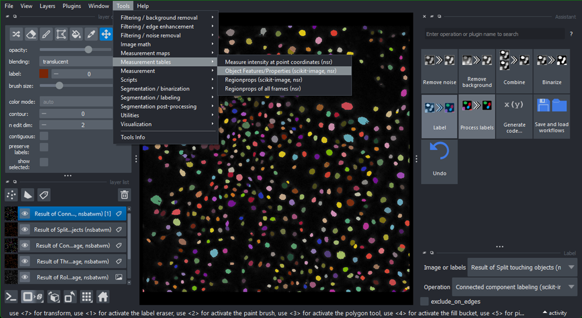
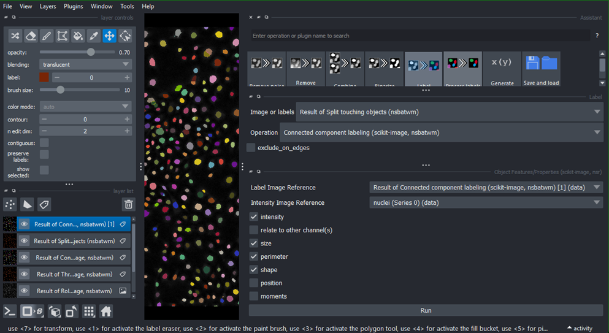
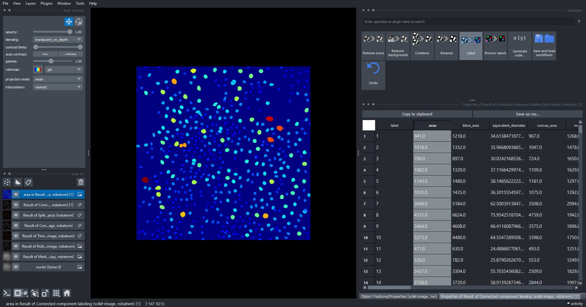

# Guía de Segmentación 3D con Napari

Esta guía práctica cubre el flujo de trabajo completo para la segmentación de imágenes 3D usando Napari y el plugin Napari Assistant.

## Objetivos de aprendizaje

Al finalizar esta sección, serás capaz de:
- Cargar y visualizar pilas de imágenes 3D en Napari
- Usar el Asistente de Napari para segmentación guiada
- Aplicar técnicas de preprocesamiento (eliminación de fondo, suavizado)
- Realizar umbralización y binarización
- Crear etiquetas de componentes conexos
- Refinar la segmentación mediante operaciones morfológicas
- Extraer y visualizar medidas morfológicas

## Descripción del pipeline de segmentación

El flujo de trabajo completo sigue estos pasos:

```
Imagen cruda
    ↓
Preprocesamiento: Eliminar fondo y ruido
    ↓ 
Binarización: Convertir a máscara de primer plano/fondo
    ↓
Etiquetado: Asignar IDs únicos a objetos individuales
    ↓
Refinamiento: Mejorar la calidad de las etiquetas mediante operaciones separación de objetos
    ↓
Cuantificación: Extraer medidas morfológicas y de intensidad
    ↓
Visualización: Analizar y explorar resultados
```

## Ejecución de la práctica

### Iniciar Napari con el plugin Asistente

```bash
pixi run -e assistant naparia
```

Esto abre Napari con el panel del asistente de segmentación que te guía a través del flujo de trabajo.

## Pasos del flujo de trabajo

## Segmentación 3D en Napari

En este ejercicio vamos a:

- Usar Napari para abrir una imagen
- Usar el asistente de Napari para visualizar un flujo de trabajo de segmentación y etiquetado de imágenes
- Usar region props para cuantificar parámetros morfológicos y hacer gráficos con código de colores

Estos pasos forman un flujo de trabajo completo:  
**imagen cruda → preprocesamiento → segmentación → limpieza → etiquetado → medición → filtrado**

Usaremos `nuclei.nd2` como imagen de ejemplo https://zenodo.org/records/15175309

Requisitos:
- Todo lo necesario está en el archivo toml en la carpeta Pixi/napari-assistant https://github.com/acorbat/workshop_segmentaiton_quantification

### 0. Abrir el asistente de Napari con Pixi
En la terminal, ve al directorio `.../workshop_segmentaiton_quantification` y ejecutá:

`pixi run -e assistant naparia`

### 1. Abrir una imagen

Arrastrá y soltá el archivo o usá

`File → Open File`



Podremos ver y explorar la imagen. En el panel derecho veremos el plugin Asistente, donde sugiere operaciones en el orden apropiado. La cantidad de operaciones y opciones depende de los plugins instalados. Algunas son redundantes.

<--! Notar que para que funcione, necesitamos una versión específica de Napari y napari assistant. Esto es lo que hace a Napari, y los desarrollos en Python tan susceptibles al versionado. En este caso, el autor original de assistant, migró a otros temas de trabajo y dejó de mantener el plugin. Para abrir las imágenes también fue necesario utilizar napari-bioformats, que ahora es supersedido por napari-bioio. Al desarrollar talleres, es importante ver qué versiones se usan hoy en día, que paquetes siguen siendo mantenidos y qué versiones se utilizaban en el taller original. En este caso, podemos ver todas las  versiones utilizadas y fijadas en el `pixi.toml`.-->

### 2. Preprocesamiento

En este caso vamos a suavizar el ruido mediante un filtro de mediana.

Seleccioná `Remove Noise → Median  → radius = 3`



<--! En estos casos es importante entender como estimar el valor del radio del kernel. En el caso del filtro de mediana, necesitamos hacer estadistica de píxeles en una vecindad pequeña, del orden de la PSF, para eliminar ruido asociasdo a la detección.-->

Luego, seleccioná `Remove Background → Rolling Ball  → radius = 40`

<--! A diferencia del caso anterior, rolling ball puede pensarse como una bola de radio mayor al de los objetos a detectar que tiene que rodar por la topografía de intensidad de la imagen.-->



### 3. Segmentación

Luego seleccioná `Binarize → Threshold Otsu`, asegurándote de seleccionar la imagen Result of Rolling Ball.



Finalmente, podemos seleccionar `Label → Connected component labeling`, asegurándote de seleccionar la imagen Result of Threshold. Adicionalmente podemos seleccionar la opción `exclude on edges`.



Algunos están pegados entre sí. Intentemos solucionarlo.

### 3. Corregir etiquetas

Seleccionemos nuevamente la capa anterior Result of Threshold. Luego seleccioná `Process labels → Split touching objects`. Esto generará una mascara binaria con cortes entre objetos pegados.



Ahora recreemos las etiquetas `Label → Connected component labeling`, asegurándote de seleccionar Result of Split of touching objects.



Ahora podemos medir con precisión las características morfológicas de estas etiquetas. Podés cerrar el panel del asistente ahora.

### 4. Medir propiedades morfológicas

Seleccioná `Tools → Measure Tables → Object Features/Properties`. Aquí asegurate de seleccionar la imagen Result of Expanded Labels. Podés seleccionar diferentes características, incluyendo características de intensidad extraídas de los datos crudos. Después de ejecutar, aparecerá una tabla que puede exportarse en formato csv.





Al hacer doble clic en cualquiera de las columnas de esta tabla, aparecerá una nueva capa de imagen con etiquetas con código de color que indica el valor de la medición seleccionada. Los mapas de color pueden ajustarse según preferencia.



<--! Esto es una buena forma de visualizar si hay valores de area que se escapan de una distribución esperada. También podemos ver sesgos en el flujo desarrollado que pueden darse por efectos espaciales de la adquisición (ej. si es más tenue en los bordes, la segmentación puede arrojar nucleos más pequeños. -->

### 5. Guardar el flujo de trabajo

Ahora podés seleccionar `Generate Code...` y exportar el flujo de trabajo que acabás de construir como un cuaderno Jupyter.


## Consejos y solución de problemas

### Problemas de calidad en la segmentación

**Problema**: Los objetos no están claramente separados o el fondo tiene ruido
- **Solución**: Ajustá el radio en el Paso 2 (White Top Hat). Un radio mayor elimina características de fondo más grandes
- Probá diferentes métodos de umbralización en el Paso 3
- Aumentá el radio de erosión en el Paso 5a para separar mejor los objetos tocantes

**Problema**: Los objetos pequeños están desapareciendo
- **Solución**: Usá un radio de erosión menor en el Paso 5a
- Considerá filtrar por tamaño en lugar de usar erosión (ver sección Avanzado)

**Problema**: Calidad de segmentación no uniforme en toda la imagen
- **Solución**: Probá umbralización local en lugar de global (si está disponible en tu versión de Napari)
- Considerá preprocesar con desenfoque gaussiano antes del white top hat

### Técnicas avanzadas

**Filtrado por tamaño**: Eliminar objetos menores a cierto tamaño
- Puede ser más efectivo que la apertura morfológica para algunas imágenes
- Proporciona un control más fino sobre la selección de objetos

**Procesamiento por lotes**: Aplicar la misma segmentación a múltiples imágenes
- El Asistente de Napari puede guardar/cargar configuraciones de parámetros
- Útil para procesar series de imágenes de forma consistente

## Requisitos de datos

Imagen de ejemplo: `Lund.tif` (disponible en https://zenodo.org/records/17986091)

Requisitos:
- Napari (herramienta principal de visualización)
- Plugin Napari Assistant (simplifica el flujo de trabajo)
- Plugin Region Props (para mediciones)
- Configuración con Pixi: `pixi install` en el directorio del repositorio

## Referencias

- [Documentación de Napari](https://napari.org/)
- [Morfología de Scikit-image](https://scikit-image.org/docs/stable/api/skimage.morphology.html)
- [Etiquetado de Componentes Conexos](https://en.wikipedia.org/wiki/Connected-component_labeling)
- [Morfología Matemática](https://en.wikipedia.org/wiki/Mathematical_morphology)
